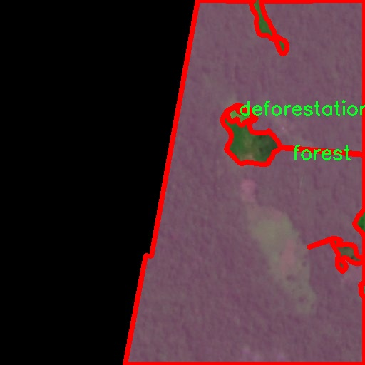

### 1.背景意义

研究背景与意义

随着全球对森林资源的依赖日益加深，森林砍伐问题愈发凸显，成为生态环境保护和可持续发展面临的重要挑战之一。森林不仅是地球生态系统的重要组成部分，还是生物多样性保护的关键所在。森林的消失不仅导致了栖息地的破坏，还加剧了气候变化，影响了水循环和土壤质量。因此，及时、准确地监测森林砍伐情况，对于制定有效的环境保护政策和管理措施至关重要。

近年来，遥感技术的快速发展为森林监测提供了新的解决方案。通过卫星影像和无人机图像等遥感数据，研究人员能够获取大范围的森林覆盖信息。然而，传统的人工监测方法不仅耗时耗力，而且难以应对大规模数据的处理需求。因此，基于深度学习的自动化检测系统应运而生，成为提高森林砍伐监测效率的重要工具。

在众多深度学习模型中，YOLO（You Only Look Once）系列因其高效的实时目标检测能力而受到广泛关注。YOLOv11作为该系列的最新版本，具备更强的特征提取和分类能力，能够在复杂的自然环境中实现高精度的目标检测。通过对YOLOv11进行改进，我们可以更好地适应遥感图像的特点，提高对森林砍伐和森林区域的检测精度。

本研究将基于改进的YOLOv11模型，构建一个高效的遥感森林砍伐检测系统。我们将利用包含4400幅图像的Defo_forest数据集，该数据集专门针对森林砍伐和森林区域进行了标注，涵盖了两类重要的生态信息。通过对该数据集的深入分析和模型训练，我们期望能够显著提升森林砍伐的检测准确率，为相关决策提供科学依据，推动生态环境保护的可持续发展。

### 2.视频效果

[2.1 视频效果](https://www.bilibili.com/video/BV1qQqiYeEZk/)

### 3.图片效果


##### [项目涉及的源码数据来源链接](https://kdocs.cn/l/cszuIiCKVNis)**

注意：本项目提供训练的数据集和训练教程,由于版本持续更新,暂不提供权重文件（best.pt）,请按照6.训练教程进行训练后实现上图演示的效果。

### 4.数据集信息

##### 4.1 本项目数据集类别数＆类别名

nc: 2
names: ['deforestation', 'forest']


该项目为【图像分割】数据集，请在【训练教程和Web端加载模型教程（第三步）】这一步的时候按照【图像分割】部分的教程来训练

##### 4.2 本项目数据集信息介绍

本项目数据集信息介绍

本项目所使用的数据集名为“Defo_forest”，旨在为改进YOLOv11的遥感森林砍伐检测系统提供高质量的训练数据。该数据集专注于遥感影像中的森林砍伐现象，包含两大主要类别：砍伐（deforestation）和森林（forest）。通过对这两类的精确标注，数据集为模型的训练提供了清晰的目标，使其能够有效地区分被砍伐的区域与健康的森林覆盖。

在数据集的构建过程中，研究团队收集了来自不同地理区域的遥感影像，确保数据的多样性和代表性。这些影像涵盖了不同季节、不同气候条件下的森林景观，旨在增强模型的泛化能力。每幅影像经过精细的标注，确保每个像素的分类准确无误，从而为YOLOv11的训练提供了坚实的基础。

数据集的设计不仅关注于图像的数量，还特别注重图像的质量和多样性。为了确保模型能够适应不同的环境变化，数据集中包含了多种不同类型的森林生态系统，如热带雨林、温带森林和针叶林等。这种多样性使得模型在面对不同类型的森林砍伐时，能够展现出更强的适应性和准确性。

此外，数据集还包含了多种标注信息，例如砍伐的面积、砍伐的时间段等，这些信息将有助于深入分析森林砍伐的动态变化，进而为相关政策的制定提供数据支持。通过对“Defo_forest”数据集的深入挖掘与分析，本项目希望能够推动遥感技术在森林保护与管理中的应用，为实现可持续发展目标贡献力量。




### 5.全套项目环境部署视频教程（零基础手把手教学）

[5.1 所需软件PyCharm和Anaconda安装教程（第一步）](https://www.bilibili.com/video/BV1BoC1YCEKi/?spm_id_from=333.999.0.0&vd_source=bc9aec86d164b67a7004b996143742dc)


[5.2 安装Python虚拟环境创建和依赖库安装视频教程（第二步）](https://www.bilibili.com/video/BV1ZoC1YCEBw?spm_id_from=333.788.videopod.sections&vd_source=bc9aec86d164b67a7004b996143742dc)

### 6.改进YOLOv11训练教程和Web_UI前端加载模型教程（零基础手把手教学）

[6.1 改进YOLOv11训练教程和Web_UI前端加载模型教程（第三步）](https://www.bilibili.com/video/BV1BoC1YCEhR?spm_id_from=333.788.videopod.sections&vd_source=bc9aec86d164b67a7004b996143742dc)


按照上面的训练视频教程链接加载项目提供的数据集，运行train.py即可开始训练



     Epoch   gpu_mem       box       obj       cls    labels  img_size
     1/200     20.8G   0.01576   0.01955  0.007536        22      1280: 100%|██████████| 849/849 [14:42<00:00,  1.04s/it]
               Class     Images     Labels          P          R     mAP@.5 mAP@.5:.95: 100%|██████████| 213/213 [01:14<00:00,  2.87it/s]
                 all       3395      17314      0.994      0.957      0.0957      0.0843

     Epoch   gpu_mem       box       obj       cls    labels  img_size
     2/200     20.8G   0.01578   0.01923  0.007006        22      1280: 100%|██████████| 849/849 [14:44<00:00,  1.04s/it]
               Class     Images     Labels          P          R     mAP@.5 mAP@.5:.95: 100%|██████████| 213/213 [01:12<00:00,  2.95it/s]
                 all       3395      17314      0.996      0.956      0.0957      0.0845

     Epoch   gpu_mem       box       obj       cls    labels  img_size
     3/200     20.8G   0.01561    0.0191  0.006895        27      1280: 100%|██████████| 849/849 [10:56<00:00,  1.29it/s]
               Class     Images     Labels          P          R     mAP@.5 mAP@.5:.95: 100%|███████   | 187/213 [00:52<00:00,  4.04it/s]
                 all       3395      17314      0.996      0.957      0.0957      0.0845


###### [项目数据集下载链接](https://kdocs.cn/l/cszuIiCKVNis)

### 7.原始YOLOv11算法讲解

YOLO11采用改进的骨干和颈部架构，增强了特征提取能力，提高了物体检测的精确度和复杂任务的表现。YOLO11引入精炼的架构设计和优化的训练流程，实现更快的处理速度，同时保持精度和性能之间的最佳平衡。通过模型设计的进步，YOLO11m在COCO数据集上实现了更高的均值平均精度（mAP），同时使用比YOLOv8m少22%的参数，使其在不妥协准确性的情况下更加计算高效。YOLO11可以无缝部署在各种环境中，包括边缘设备、云平台以及支持NVIDIA
GPU的系统，确保最大灵活性。无论是物体检测、实例分割、图像分类、姿态估计，还是定向物体检测（OBB），YOLO11都旨在应对多样的计算机视觉挑战。


##### **Ultralytics YOLO11相比于之前版本的主要改进有哪些？**

Ultralytics YOLO11在其前身基础上引入了几项重要进步。主要改进包括：

  1. **增强的特征提取** ：YOLO11采用改进的骨干和颈部架构，增强了特征提取能力，提高了物体检测的精确度。
  2.  **优化的效率和速度** ：精炼的架构设计和优化的训练流程实现了更快的处理速度，同时保持了准确性和性能之间的平衡。
  3.  **更高的准确性与更少的参数** ：YOLO11m在COCO数据集上实现了更高的均值平均精度（mAP），同时使用比YOLOv8m少22%的参数，使其在不妥协准确性的情况下更加计算高效。
  4.  **环境适应性强** ：YOLO11可以在多种环境中部署，包括边缘设备、云平台以及支持NVIDIA GPU的系统。
  5.  **支持广泛的任务** ：YOLO11支持多种计算机视觉任务，如物体检测、实例分割、图像分类、姿态估计和定向物体检测（OBB）。

我们先来看一下其网络结构有什么变化，可以看出，相比较于YOLOv8模型，其将CF2模块改成C3K2，同时在SPPF模块后面添加了一个C2PSA模块，且将YOLOv10的head思想引入到YOLO11的head中，使用深度可分离的方法，减少冗余计算，提高效率。下面我们来详细看一下这两个模块的结构是怎么构成的，以及它们为什么要这样设计


##### C3K2的网络结构

从下面图中我们可以看到，C3K2模块其实就是C2F模块转变出来的，它代码中有一个设置，就是当c3k这个参数为FALSE的时候，C3K2模块就是C2F模块，也就是说它的Bottleneck是普通的Bottleneck；反之当它为true的时候，将Bottleneck模块替换成C3模块。


##### C2PSA的网络结构

` `C2PSA是对 `C2f` 模块的扩展，它结合了PSA(Pointwise Spatial
Attention)块，用于增强特征提取和注意力机制。通过在标准 `C2f` 模块中引入 PSA
块，C2PSA实现了更强大的注意力机制，从而提高了模型对重要特征的捕捉能力。


##### **C2f 模块回顾：**

**** C2f模块是一个更快的 CSP（Cross Stage Partial）瓶颈实现，它通过两个卷积层和多个 Bottleneck
块进行特征提取。相比传统的 CSPNet，C2f 优化了瓶颈层的结构，使得计算速度更快。在 C2f中，`cv1` 是第一个 1x1
卷积，用于减少通道数；`cv2` 是另一个 1x1 卷积，用于恢复输出通道数。而 `n` 是一个包含 Bottleneck 块的数量，用于提取特征。

##### **C2PSA 模块的增强** ：

**C2PSA** 扩展了 C2f，通过引入PSA( **Position-Sensitive Attention)**
，旨在通过多头注意力机制和前馈神经网络来增强特征提取能力。它可以选择性地添加残差结构（shortcut）以优化梯度传播和网络训练效果。同时，使用FFN
可以将输入特征映射到更高维的空间，捕获输入特征的复杂非线性关系，允许模型学习更丰富的特征表示。

##### head部分

YOLO11在head部分的cls分支上使用深度可分离卷积 ，具体代码如下，cv2边界框回归分支，cv3分类分支。

    
    
     self.cv2 = nn.ModuleList(
                nn.Sequential(Conv(x, c2, 3), Conv(c2, c2, 3), nn.Conv2d(c2, 4 * self.reg_max, 1)) for x in ch
            )
            self.cv3 = nn.ModuleList(
                nn.Sequential(
                    nn.Sequential(DWConv(x, x, 3), Conv(x, c3, 1)),
                    nn.Sequential(DWConv(c3, c3, 3), Conv(c3, c3, 1)),
                    nn.Conv2d(c3, self.nc, 1),
                )
                for x in ch
            )


### 8.200+种全套改进YOLOV11创新点原理讲解

#### 8.1 200+种全套改进YOLOV11创新点原理讲解大全

由于篇幅限制，每个创新点的具体原理讲解就不全部展开，具体见下列网址中的改进模块对应项目的技术原理博客网址【Blog】（创新点均为模块化搭建，原理适配YOLOv5~YOLOv11等各种版本）

[改进模块技术原理博客【Blog】网址链接](https://gitee.com/qunmasj/good)


#### 8.2 精选部分改进YOLOV11创新点原理讲解

###### 这里节选部分改进创新点展开原理讲解(完整的改进原理见上图和[改进模块技术原理博客链接](https://gitee.com/qunmasj/good)【如果此小节的图加载失败可以通过CSDN或者Github搜索该博客的标题访问原始博客，原始博客图片显示正常】


借鉴了其他算法的这些设计思想

借鉴了VGG的思想，使用了较多的3×3卷积，在每一次池化操作后，将通道数翻倍；

借鉴了network in network的思想，使用全局平均池化（global average pooling）做预测，并把1×1的卷积核置于3×3的卷积核之间，用来压缩特征；（我没找到这一步体现在哪里）

使用了批归一化层稳定模型训练，加速收敛，并且起到正则化作用。

    以上三点为Darknet19借鉴其他模型的点。Darknet53当然是在继承了Darknet19的这些优点的基础上再新增了下面这些优点的。因此列在了这里

借鉴了ResNet的思想，在网络中大量使用了残差连接，因此网络结构可以设计的很深，并且缓解了训练中梯度消失的问题，使得模型更容易收敛。

使用步长为2的卷积层代替池化层实现降采样。（这一点在经典的Darknet-53上是很明显的，output的长和宽从256降到128，再降低到64，一路降低到8，应该是通过步长为2的卷积层实现的；在YOLOv11的卷积层中也有体现，比如图中我标出的这些位置）

#### 特征融合

模型架构图如下

  Darknet-53的特点可以这样概括：（Conv卷积模块+Residual Block残差块）串行叠加4次

  Conv卷积层+Residual Block残差网络就被称为一个stage


上面红色指出的那个，原始的Darknet-53里面有一层 卷积，在YOLOv11里面，把一层卷积移除了

为什么移除呢？

        原始Darknet-53模型中间加的这个卷积层做了什么？滤波器（卷积核）的个数从 上一个卷积层的512个，先增加到1024个卷积核，然后下一层卷积的卷积核的个数又降低到512个

        移除掉这一层以后，少了1024个卷积核，就可以少做1024次卷积运算，同时也少了1024个3×3的卷积核的参数，也就是少了9×1024个参数需要拟合。这样可以大大减少了模型的参数，（相当于做了轻量化吧）

        移除掉这个卷积层，可能是因为作者发现移除掉这个卷积层以后，模型的score有所提升，所以才移除掉的。为什么移除掉以后，分数有所提高呢？可能是因为多了这些参数就容易，参数过多导致模型在训练集删过拟合，但是在测试集上表现很差，最终模型的分数比较低。你移除掉这个卷积层以后，参数减少了，过拟合现象不那么严重了，泛化能力增强了。当然这个是，拿着你做实验的结论，反过来再找补，再去强行解释这种现象的合理性。

过拟合


通过MMdetection官方绘制册这个图我们可以看到，进来的这张图片经过一个“Feature Pyramid Network(简称FPN)”，然后最后的P3、P4、P5传递给下一层的Neck和Head去做识别任务。 PAN（Path Aggregation Network）


“FPN是自顶向下，将高层的强语义特征传递下来。PAN就是在FPN的后面添加一个自底向上的金字塔，对FPN补充，将低层的强定位特征传递上去，

FPN是自顶（小尺寸，卷积次数多得到的结果，语义信息丰富）向下（大尺寸，卷积次数少得到的结果），将高层的强语义特征传递下来，对整个金字塔进行增强，不过只增强了语义信息，对定位信息没有传递。PAN就是针对这一点，在FPN的后面添加一个自底（卷积次数少，大尺寸）向上（卷积次数多，小尺寸，语义信息丰富）的金字塔，对FPN补充，将低层的强定位特征传递上去，又被称之为“双塔战术”。

FPN层自顶向下传达强语义特征，而特征金字塔则自底向上传达强定位特征，两两联手，从不同的主干层对不同的检测层进行参数聚合,这样的操作确实很皮。
#### 自底向上增强

而 PAN（Path Aggregation Network）是对 FPN 的一种改进，它的设计理念是在 FPN 后面添加一个自底向上的金字塔。PAN 引入了路径聚合的方式，通过将浅层特征图（低分辨率但语义信息较弱）和深层特征图（高分辨率但语义信息丰富）进行聚合，并沿着特定的路径传递特征信息，将低层的强定位特征传递上去。这样的操作能够进一步增强多尺度特征的表达能力，使得 PAN 在目标检测任务中表现更加优秀。


### 可重参化EfficientRepBiPAN优化Neck
#### Repvgg-style
Repvgg-style的卷积层包含
卷积+ReLU结构，该结构能够有效地利用硬件资源。

在训练时，Repvgg-style的卷积层包含
卷积、
卷积、identity。（下图左图）


在推理时，通过重参数化（re-parameterization），上述的多分支结构可以转换为单分支的
卷积。（下图右图）


基于上述思想，作者设计了对GPU硬件友好的EfficientRep Backbone和Rep-PAN Neck，将它们用于YOLOv6中。

EfficientRep Backbone的结构图：


Rep-PAN Neck结构图：


#### Multi-path
只使用repvgg-style不能达到很好的精度-速度平衡，对于大模型，作者探索了多路径的网络结构。

参考该博客提出了Bep unit，其结构如下图所示：


CSP（Cross Stage Partial）-style计算量小，且有丰富的梯度融合信息，广泛应用于YOLO系列中，比如YOLOv11、PPYOLOE。

作者将Bep unit与CSP-style结合，设计了一种新的网络结构BepC3，如下图所示：


基于BepC3模块，作者设计了新的CSPBep Backbone和CSPRepPAN Neck，以达到很好的精度-速度平衡。

其他YOLO系列在使用CSP-stype结构时，partial ratio设置为1/2。为了达到更好的性能，在YOLOv6m中partial ratio的值为2/3，在YOLOv6l中partial ratio的值为1/2。

对于YOLOv6m，单纯使用Rep-style结构和使用BepC3结构的对比如下图所示：

#### BIFPN
BiFPN 全称 Bidirectional Feature Pyramid Network 加权双向（自顶向下 + 自低向上）特征金字塔网络。

相比较于PANet，BiFPN在设计上的改变：

总结下图：
图d 蓝色部分为自顶向下的通路，传递的是高层特征的语义信息；红色部分是自底向上的通路，传递的是低层特征的位置信息；紫色部分是上述第二点提到的同一层在输入节点和输入节点间新加的一条边。


我们删除那些只有一条输入边的节点。这么做的思路很简单：如果一个节点只有一条输入边而没有特征融合，那么它对旨在融合不同特征的特征网络的贡献就会很小。删除它对我们的网络影响不大，同时简化了双向网络；如上图d 的 P7右边第一个节点

如果原始输入节点和输出节点处于同一层，我们会在原始输入节点和输出节点之间添加一条额外的边。思路：以在不增加太多成本的情况下融合更多的特性；

与只有一个自顶向下和一个自底向上路径的PANet不同，我们处理每个双向路径(自顶向下和自底而上)路径作为一个特征网络层，并重复同一层多次，以实现更高层次的特征融合。如下图EfficientNet 的网络结构所示，我们对BiFPN是重复使用多次的。而这个使用次数也不是我们认为设定的，而是作为参数一起加入网络的设计当中，使用NAS技术算出来的。


Weighted Feature Fusion 带权特征融合：学习不同输入特征的重要性，对不同输入特征有区分的融合。
设计思路：传统的特征融合往往只是简单的 feature map 叠加/相加 (sum them up)，比如使用concat或者shortcut连接，而不对同时加进来的 feature map 进行区分。然而，不同的输入 feature map 具有不同的分辨率，它们对融合输入 feature map 的贡献也是不同的，因此简单的对他们进行相加或叠加处理并不是最佳的操作。所以这里我们提出了一种简单而高效的加权特融合的机制。
常见的带权特征融合有三种方法，分别是：


​
  这种方法比较简单，直接加一个可学习的权重。但是由于这个权重不受限制，所有可能引起训练的不稳定，所有并不推荐。
Softmax-based fusion: O = ∑ i e w i ∗ I i ϵ + ∑ j e w j O = \sum_{i} \frac{e^{w_i} * I_i}{ \epsilon+\sum_{j}e^{w_j}}O=∑ 

 

​
  使用这种方法可以将范围放缩到 [ 0 , 1 ] [0, 1][0,1] 之间，训练稳定，但是训练很慢，所有也不推荐。
Fast normalized fusion: O = ∑ i w i ∗ I i ϵ + ∑ j w j O = \sum_{i} \frac{w_i * I_i}{ \epsilon+\sum_{j}w_j}O=∑ 


### 9.系统功能展示

图9.1.系统支持检测结果表格显示

  图9.2.系统支持置信度和IOU阈值手动调节

  图9.3.系统支持自定义加载权重文件best.pt(需要你通过步骤5中训练获得)

  图9.4.系统支持摄像头实时识别

  图9.5.系统支持图片识别

  图9.6.系统支持视频识别

  图9.7.系统支持识别结果文件自动保存

  图9.8.系统支持Excel导出检测结果数据


### 10. YOLOv11核心改进源码讲解

#### 10.1 CTrans.py

以下是对代码中最核心部分的提炼和详细注释：

```python
import torch
import torch.nn as nn
import numpy as np
from torch.nn import Dropout, Softmax, LayerNorm

class Channel_Embeddings(nn.Module):
    """通道嵌入类，用于将输入图像分割成补丁并添加位置嵌入。"""
    def __init__(self, patchsize, img_size, in_channels):
        super().__init__()
        img_size = (img_size, img_size)  # 将图像大小转换为元组
        patch_size = (patchsize, patchsize)  # 将补丁大小转换为元组
        n_patches = (img_size[0] // patch_size[0]) * (img_size[1] // patch_size[1])  # 计算补丁数量

        # 使用最大池化和卷积层构建补丁嵌入
        self.patch_embeddings = nn.Sequential(
            nn.MaxPool2d(kernel_size=5, stride=5),
            nn.Conv2d(in_channels=in_channels,
                      out_channels=in_channels,
                      kernel_size=patchsize // 5,
                      stride=patchsize // 5)
        )
        self.position_embeddings = nn.Parameter(torch.zeros(1, n_patches, in_channels))  # 位置嵌入
        self.dropout = Dropout(0.1)  # Dropout层

    def forward(self, x):
        """前向传播函数，计算嵌入。"""
        if x is None:
            return None
        x = self.patch_embeddings(x)  # 通过补丁嵌入层
        x = x.flatten(2)  # 展平
        x = x.transpose(-1, -2)  # 转置
        embeddings = x + self.position_embeddings  # 添加位置嵌入
        embeddings = self.dropout(embeddings)  # 应用Dropout
        return embeddings

class Attention_org(nn.Module):
    """自定义的多头注意力机制。"""
    def __init__(self, vis, channel_num):
        super(Attention_org, self).__init__()
        self.vis = vis
        self.KV_size = sum(channel_num)  # 键值对的总大小
        self.channel_num = channel_num
        self.num_attention_heads = 4  # 注意力头的数量

        # 定义查询、键、值的线性变换
        self.query = nn.ModuleList([nn.Linear(c, c, bias=False) for c in channel_num])
        self.key = nn.Linear(self.KV_size, self.KV_size, bias=False)
        self.value = nn.Linear(self.KV_size, self.KV_size, bias=False)
        self.softmax = Softmax(dim=3)  # Softmax层
        self.attn_dropout = Dropout(0.1)  # Dropout层

    def forward(self, emb_list, emb_all):
        """前向传播函数，计算注意力输出。"""
        multi_head_Q_list = [query(emb) for query, emb in zip(self.query, emb_list) if emb is not None]
        multi_head_K = self.key(emb_all)  # 计算键
        multi_head_V = self.value(emb_all)  # 计算值

        # 计算注意力分数
        attention_scores = [torch.matmul(Q, multi_head_K) / np.sqrt(self.KV_size) for Q in multi_head_Q_list]
        attention_probs = [self.softmax(score) for score in attention_scores]  # 计算注意力概率

        # 应用Dropout
        attention_probs = [self.attn_dropout(prob) for prob in attention_probs]

        # 计算上下文层
        context_layers = [torch.matmul(prob, multi_head_V) for prob in attention_probs]
        return context_layers

class Block_ViT(nn.Module):
    """ViT块，包含注意力和前馈网络。"""
    def __init__(self, vis, channel_num):
        super(Block_ViT, self).__init__()
        self.attn_norm = LayerNorm(sum(channel_num), eps=1e-6)  # 归一化层
        self.channel_attn = Attention_org(vis, channel_num)  # 注意力机制
        self.ffn = nn.Sequential(
            nn.Linear(channel_num[0], channel_num[0] * 4),  # 前馈网络
            nn.GELU(),
            nn.Linear(channel_num[0] * 4, channel_num[0])
        )

    def forward(self, emb_list):
        """前向传播函数，执行注意力和前馈网络。"""
        emb_all = torch.cat(emb_list, dim=2)  # 拼接所有嵌入
        attn_output = self.channel_attn(emb_list, emb_all)  # 计算注意力输出
        # 添加残差连接
        output = [emb + attn for emb, attn in zip(emb_list, attn_output)]
        return output

class Encoder(nn.Module):
    """编码器类，包含多个ViT块。"""
    def __init__(self, vis, channel_num):
        super(Encoder, self).__init__()
        self.layer = nn.ModuleList([Block_ViT(vis, channel_num) for _ in range(1)])  # 添加ViT块

    def forward(self, emb_list):
        """前向传播函数，依次通过所有块。"""
        for layer_block in self.layer:
            emb_list = layer_block(emb_list)  # 通过块
        return emb_list

class ChannelTransformer(nn.Module):
    """通道变换器，整体模型结构。"""
    def __init__(self, channel_num=[64, 128, 256, 512], img_size=640, vis=False, patchSize=[40, 20, 10, 5]):
        super().__init__()
        self.embeddings = nn.ModuleList([Channel_Embeddings(patchSize[i], img_size // (2 ** (i + 2)), channel_num[i]) for i in range(len(channel_num))])
        self.encoder = Encoder(vis, channel_num)  # 编码器

    def forward(self, en):
        """前向传播函数，计算最终输出。"""
        emb_list = [embedding(en[i]) for i, embedding in enumerate(self.embeddings) if en[i] is not None]
        encoded = self.encoder(emb_list)  # 编码
        return encoded  # 返回编码后的结果
```

### 代码核心部分说明：
1. **Channel_Embeddings**: 该类负责将输入图像分割成补丁，并添加位置嵌入，最终输出嵌入表示。
2. **Attention_org**: 实现了多头注意力机制，计算输入嵌入的注意力分数和上下文信息。
3. **Block_ViT**: 由注意力层和前馈网络组成的基本块，负责处理嵌入并进行特征提取。
4. **Encoder**: 由多个ViT块组成的编码器，逐层处理输入的嵌入。
5. **ChannelTransformer**: 整体模型结构，负责初始化嵌入层和编码器，并实现前向传播逻辑。

这些类和方法共同构成了一个通道变换器模型，适用于图像处理任务。

这个程序文件 `CTrans.py` 实现了一个名为 `ChannelTransformer` 的深度学习模型，主要用于图像处理任务。该模型结合了通道注意力机制和图像块嵌入，能够有效地提取图像特征。以下是对代码的逐部分分析。

首先，文件导入了一些必要的库，包括 `torch` 和 `torch.nn`，这些库提供了构建神经网络所需的基础模块和功能。接着，定义了几个类，分别用于构建模型的不同部分。

`Channel_Embeddings` 类负责将输入图像划分为多个块，并为每个块生成嵌入。它使用了最大池化和卷积层来处理输入图像，并通过位置嵌入来保留块的位置信息。前向传播过程中，输入图像经过处理后，返回嵌入结果。

`Reconstruct` 类用于重建特征图。它通过卷积层和上采样操作，将嵌入的特征图恢复到原始图像的尺寸，并应用批归一化和激活函数以增强特征表达能力。

`Attention_org` 类实现了多头注意力机制。它接受多个嵌入作为输入，并计算注意力权重，以便在不同通道之间进行信息交互。注意力机制通过计算查询、键和值的点积来生成注意力分数，并使用 softmax 函数将其转化为概率分布。最后，通过加权求和的方式得到上下文特征。

`Mlp` 类实现了一个简单的多层感知机，包含两个全连接层和激活函数，主要用于特征的非线性变换。

`Block_ViT` 类是一个基本的 Transformer 块，包含注意力层和前馈网络。它对输入的嵌入进行归一化处理，并通过多头注意力和前馈网络进行特征提取和增强。

`Encoder` 类由多个 `Block_ViT` 组成，负责对输入的多个嵌入进行编码。它将输入嵌入传递给每个 Transformer 块，并在每个块之后进行归一化处理。

`ChannelTransformer` 类是整个模型的核心，负责初始化各个组件，包括嵌入层、编码器和重建层。在前向传播中，它首先将输入图像分块并生成嵌入，然后通过编码器处理这些嵌入，最后重建输出特征图。

最后，`GetIndexOutput` 类用于从模型的输出中提取特定索引的结果，方便后续处理。

总体来说，这个文件实现了一个复杂的图像处理模型，结合了卷积、注意力机制和多层感知机，旨在提高图像特征提取的效果。模型的设计充分考虑了通道间的信息交互，适用于需要高效特征提取的视觉任务。

#### 10.2 repvit.py

以下是经过简化和注释的核心代码部分：

```python
import torch
import torch.nn as nn
from timm.models.layers import SqueezeExcite

def _make_divisible(v, divisor, min_value=None):
    """
    确保所有层的通道数是8的倍数
    :param v: 输入值
    :param divisor: 除数
    :param min_value: 最小值
    :return: 可被divisor整除的值
    """
    if min_value is None:
        min_value = divisor
    new_v = max(min_value, int(v + divisor / 2) // divisor * divisor)
    # 确保向下取整不会低于原值的90%
    if new_v < 0.9 * v:
        new_v += divisor
    return new_v

class Conv2d_BN(nn.Sequential):
    """
    组合卷积层和批归一化层的类
    """
    def __init__(self, in_channels, out_channels, kernel_size=1, stride=1, padding=0, dilation=1, groups=1):
        super().__init__()
        # 添加卷积层
        self.add_module('conv', nn.Conv2d(in_channels, out_channels, kernel_size, stride, padding, dilation, groups, bias=False))
        # 添加批归一化层
        self.add_module('bn', nn.BatchNorm2d(out_channels))

    @torch.no_grad()
    def fuse_self(self):
        """
        融合卷积层和批归一化层为一个卷积层
        """
        conv, bn = self._modules.values()
        # 计算融合后的权重和偏置
        w = bn.weight / (bn.running_var + bn.eps)**0.5
        w = conv.weight * w[:, None, None, None]
        b = bn.bias - bn.running_mean * bn.weight / (bn.running_var + bn.eps)**0.5
        # 创建新的卷积层
        fused_conv = nn.Conv2d(w.size(1) * conv.groups, w.size(0), w.shape[2:], stride=conv.stride, padding=conv.padding, dilation=conv.dilation, groups=conv.groups)
        fused_conv.weight.data.copy_(w)
        fused_conv.bias.data.copy_(b)
        return fused_conv

class RepViTBlock(nn.Module):
    """
    RepViT模块，用于构建RepViT网络的基本单元
    """
    def __init__(self, inp, hidden_dim, oup, kernel_size, stride, use_se, use_hs):
        super(RepViTBlock, self).__init__()
        self.identity = stride == 1 and inp == oup
        assert(hidden_dim == 2 * inp)

        if stride == 2:
            # 当步幅为2时，使用卷积和SqueezeExcite模块
            self.token_mixer = nn.Sequential(
                Conv2d_BN(inp, inp, kernel_size, stride, (kernel_size - 1) // 2, groups=inp),
                SqueezeExcite(inp, 0.25) if use_se else nn.Identity(),
                Conv2d_BN(inp, oup, ks=1, stride=1, pad=0)
            )
        else:
            assert(self.identity)
            # 当步幅为1时，使用RepVGGDW模块
            self.token_mixer = nn.Sequential(
                RepVGGDW(inp),
                SqueezeExcite(inp, 0.25) if use_se else nn.Identity(),
            )

    def forward(self, x):
        return self.token_mixer(x)

class RepViT(nn.Module):
    """
    RepViT网络结构
    """
    def __init__(self, cfgs):
        super(RepViT, self).__init__()
        self.cfgs = cfgs
        input_channel = self.cfgs[0][2]
        # 构建初始层
        patch_embed = nn.Sequential(Conv2d_BN(3, input_channel // 2, 3, 2, 1), nn.GELU(),
                                     Conv2d_BN(input_channel // 2, input_channel, 3, 2, 1))
        layers = [patch_embed]
        # 构建RepViT块
        for k, t, c, use_se, use_hs, s in self.cfgs:
            output_channel = _make_divisible(c, 8)
            exp_size = _make_divisible(input_channel * t, 8)
            layers.append(RepViTBlock(input_channel, exp_size, output_channel, k, s, use_se, use_hs))
            input_channel = output_channel
        self.features = nn.ModuleList(layers)

    def forward(self, x):
        for f in self.features:
            x = f(x)
        return x

def repvit_m2_3(weights=''):
    """
    构建RepViT模型
    """
    cfgs = [
        # k, t, c, SE, HS, s 
        [3, 2, 80, 1, 0, 1],
        # 省略其他配置...
    ]
    model = RepViT(cfgs)
    if weights:
        model.load_state_dict(torch.load(weights)['model'])
    return model

if __name__ == '__main__':
    model = repvit_m2_3('repvit_m2_3_distill_450e.pth')
    inputs = torch.randn((1, 3, 640, 640))
    res = model(inputs)
    for i in res:
        print(i.size())
```

### 代码说明：
1. **_make_divisible**: 确保输入的通道数是8的倍数，以满足某些网络结构的要求。
2. **Conv2d_BN**: 该类将卷积层和批归一化层结合在一起，并提供了一个方法用于融合这两个层以提高推理速度。
3. **RepViTBlock**: 这是RepViT网络的基本构建块，包含了不同的卷积和激活函数组合。
4. **RepViT**: 这是整个RepViT网络的定义，包含多个RepViTBlock，并根据配置构建网络。
5. **repvit_m2_3**: 这是一个构建RepViT模型的函数，可以加载预训练权重。

通过这些核心部分和注释，您可以更好地理解RepViT模型的结构和功能。

这个程序文件 `repvit.py` 实现了一个基于 RepVGG 架构的视觉模型，主要用于图像分类等任务。程序中包含了多个类和函数，下面对其进行详细说明。

首先，程序导入了必要的库，包括 PyTorch 的神经网络模块 `torch.nn`、NumPy、以及 `timm` 库中的 SqueezeExcite 层。接着，定义了一个 `__all__` 列表，列出了可供外部调用的模型名称。

接下来，定义了一个 `replace_batchnorm` 函数，用于替换网络中的 BatchNorm 层。该函数遍历网络的所有子模块，如果发现子模块具有 `fuse_self` 方法，则调用该方法进行融合；如果是 BatchNorm 层，则将其替换为身份映射（`torch.nn.Identity()`），以减少计算开销。

`_make_divisible` 函数确保所有层的通道数是可被 8 整除的，这在构建深度学习模型时是一个常见的做法，尤其是在移动设备上运行时，以提高性能。

接下来定义了 `Conv2d_BN` 类，它是一个包含卷积层和 BatchNorm 层的顺序容器。该类在初始化时创建卷积层和 BatchNorm 层，并对 BatchNorm 的权重和偏置进行初始化。它还定义了 `fuse_self` 方法，用于将卷积层和 BatchNorm 层融合为一个卷积层，以提高推理速度。

`Residual` 类实现了残差连接，允许输入直接与经过卷积层处理的输出相加。它也包含了 `fuse_self` 方法，用于在推理时融合层。

`RepVGGDW` 类是一个特殊的卷积模块，结合了深度可分离卷积和残差连接。它在前向传播中使用了两个卷积层和 BatchNorm 层，并在 `fuse_self` 方法中实现了融合逻辑。

`RepViTBlock` 类是模型的基本构建块，结合了通道混合和令牌混合的操作。根据步幅的不同，它会选择不同的结构来处理输入数据。

`RepViT` 类是整个模型的核心，负责构建模型的结构。它根据配置列表构建多个 `RepViTBlock`，并在前向传播中返回特征图。该类还包含 `switch_to_deploy` 方法，用于在推理时替换 BatchNorm 层。

`update_weight` 函数用于更新模型的权重，确保新权重与模型的结构相匹配。

最后，定义了多个函数（如 `repvit_m0_9`、`repvit_m1_0` 等），每个函数都构建一个特定配置的 RepViT 模型，并可选择加载预训练权重。

在 `__main__` 部分，程序创建了一个 `repvit_m2_3` 模型实例，并使用随机输入进行测试，输出每个特征图的尺寸。

总体而言，这个程序实现了一个灵活且高效的视觉模型，结合了现代卷积神经网络的设计理念，适用于各种计算机视觉任务。

#### 10.3 mamba_yolo.py

以下是代码中最核心的部分，并附上详细的中文注释：

```python
import torch
import torch.nn as nn
from einops import rearrange

class LayerNorm2d(nn.Module):
    """二维层归一化类"""
    def __init__(self, normalized_shape, eps=1e-6, elementwise_affine=True):
        super().__init__()
        # 初始化LayerNorm，normalized_shape为需要归一化的形状
        self.norm = nn.LayerNorm(normalized_shape, eps, elementwise_affine)

    def forward(self, x):
        # 将输入x的形状从 (B, C, H, W) 转换为 (B, H, W, C)
        x = rearrange(x, 'b c h w -> b h w c').contiguous()
        # 对转换后的张量进行归一化
        x = self.norm(x)
        # 将归一化后的张量形状转换回 (B, C, H, W)
        x = rearrange(x, 'b h w c -> b c h w').contiguous()
        return x

class CrossScan(torch.autograd.Function):
    """交叉扫描操作"""
    @staticmethod
    def forward(ctx, x: torch.Tensor):
        B, C, H, W = x.shape
        ctx.shape = (B, C, H, W)
        # 创建一个新的张量，用于存储交叉扫描的结果
        xs = x.new_empty((B, 4, C, H * W))
        xs[:, 0] = x.flatten(2, 3)  # 原始顺序
        xs[:, 1] = x.transpose(dim0=2, dim1=3).flatten(2, 3)  # 旋转90度
        xs[:, 2:4] = torch.flip(xs[:, 0:2], dims=[-1])  # 反转
        return xs

    @staticmethod
    def backward(ctx, ys: torch.Tensor):
        B, C, H, W = ctx.shape
        L = H * W
        # 反向传播计算
        ys = ys[:, 0:2] + ys[:, 2:4].flip(dims=[-1]).view(B, 2, -1, L)
        y = ys[:, 0] + ys[:, 1].view(B, -1, W, H).transpose(dim0=2, dim1=3).contiguous().view(B, -1, L)
        return y.view(B, -1, H, W)

class SelectiveScanCore(torch.autograd.Function):
    """选择性扫描核心操作"""
    @staticmethod
    @torch.cuda.amp.custom_fwd
    def forward(ctx, u, delta, A, B, C, D=None, delta_bias=None, delta_softplus=False, nrows=1, backnrows=1, oflex=True):
        # 确保输入张量是连续的
        if u.stride(-1) != 1:
            u = u.contiguous()
        if delta.stride(-1) != 1:
            delta = delta.contiguous()
        if D is not None and D.stride(-1) != 1:
            D = D.contiguous()
        if B.stride(-1) != 1:
            B = B.contiguous()
        if C.stride(-1) != 1:
            C = C.contiguous()
        
        # 处理输入维度
        if B.dim() == 3:
            B = B.unsqueeze(dim=1)
            ctx.squeeze_B = True
        if C.dim() == 3:
            C = C.unsqueeze(dim=1)
            ctx.squeeze_C = True
        
        ctx.delta_softplus = delta_softplus
        ctx.backnrows = backnrows
        
        # 调用CUDA核心的前向函数
        out, x, *rest = selective_scan_cuda_core.fwd(u, delta, A, B, C, D, delta_bias, delta_softplus, 1)
        ctx.save_for_backward(u, delta, A, B, C, D, delta_bias, x)
        return out

    @staticmethod
    @torch.cuda.amp.custom_bwd
    def backward(ctx, dout, *args):
        u, delta, A, B, C, D, delta_bias, x = ctx.saved_tensors
        if dout.stride(-1) != 1:
            dout = dout.contiguous()
        # 调用CUDA核心的反向函数
        du, ddelta, dA, dB, dC, dD, ddelta_bias, *rest = selective_scan_cuda_core.bwd(
            u, delta, A, B, C, D, delta_bias, dout, x, ctx.delta_softplus, 1
        )
        return (du, ddelta, dA, dB, dC, dD, ddelta_bias, None, None, None, None)

def cross_selective_scan(
        x: torch.Tensor,
        x_proj_weight: torch.Tensor,
        dt_projs_weight: torch.Tensor,
        A_logs: torch.Tensor,
        Ds: torch.Tensor,
        out_norm: torch.nn.Module,
        nrows=-1,
        backnrows=-1,
        delta_softplus=True,
        to_dtype=True,
        force_fp32=False,
        ssoflex=True,
):
    """交叉选择性扫描操作"""
    B, D, H, W = x.shape
    D, N = A_logs.shape
    K, D, R = dt_projs_weight.shape
    L = H * W

    # 交叉扫描
    xs = CrossScan.apply(x)

    # 计算双重投影
    x_dbl = torch.einsum("b k d l, k c d -> b k c l", xs, x_proj_weight)
    dts, Bs, Cs = torch.split(x_dbl, [R, N, N], dim=2)
    dts = torch.einsum("b k r l, k d r -> b k d l", dts, dt_projs_weight)
    
    # HiPPO矩阵
    As = -torch.exp(A_logs.to(torch.float))  # 计算A的值
    Bs = Bs.contiguous()
    Cs = Cs.contiguous()
    Ds = Ds.to(torch.float)  # 将Ds转换为浮点数
    delta_bias = dt_projs_bias.view(-1).to(torch.float)

    # 选择性扫描
    ys: torch.Tensor = SelectiveScan.apply(
        xs, dts, As, Bs, Cs, Ds, delta_bias, delta_softplus
    ).view(B, K, -1, H, W)

    # 合并结果
    y: torch.Tensor = CrossMerge.apply(ys)

    # 归一化输出
    y = out_norm(y).view(B, H, W, -1)

    return (y.to(x.dtype) if to_dtype else y)

class SS2D(nn.Module):
    """SS2D模块"""
    def __init__(self, d_model=96, d_state=16, ssm_ratio=2.0, act_layer=nn.SiLU, dropout=0.0):
        super().__init__()
        self.in_proj = nn.Conv2d(d_model, d_model * ssm_ratio, kernel_size=1)
        self.act = act_layer()
        self.out_proj = nn.Conv2d(d_model * ssm_ratio, d_model, kernel_size=1)
        self.dropout = nn.Dropout(dropout)

    def forward(self, x: torch.Tensor):
        x = self.in_proj(x)
        x = self.act(x)
        x = self.dropout(x)
        x = self.out_proj(x)
        return x

class VSSBlock_YOLO(nn.Module):
    """VSSBlock_YOLO模块"""
    def __init__(self, in_channels: int, hidden_dim: int, drop_path: float):
        super().__init__()
        self.proj_conv = nn.Conv2d(in_channels, hidden_dim, kernel_size=1)
        self.ss2d = SS2D(d_model=hidden_dim)
        self.drop_path = DropPath(drop_path)

    def forward(self, input: torch.Tensor):
        input = self.proj_conv(input)
        x = self.ss2d(input)
        x = input + self.drop_path(x)  # 残差连接
        return x
```

### 代码核心部分说明：
1. **LayerNorm2d**: 实现了二维层归一化，用于对图像数据进行归一化处理。
2. **CrossScan**: 实现了交叉扫描操作，生成不同方向的特征图，方便后续处理。
3. **SelectiveScanCore**: 实现了选择性扫描的前向和反向传播逻辑，核心用于处理输入数据的选择性扫描。
4. **cross_selective_scan**: 结合了交叉扫描和选择性扫描的操作，处理输入数据并进行投影。
5. **SS2D**: 实现了一个简单的SSM（状态空间模型）模块，包含输入投影、激活函数和输出投影。
6. **VSSBlock_YOLO**: 组合了输入投影、SSM模块和残差连接，形成YOLO模型中的一个重要模块。

这些核心部分共同构成了一个用于视觉任务的深度学习模型，利用状态空间模型和选择性扫描等技术来提高模型的性能。

这个程序文件 `mamba_yolo.py` 是一个实现了 YOLO（You Only Look Once）目标检测模型的 PyTorch 代码。文件中定义了多个类和函数，主要用于构建和训练深度学习模型，特别是涉及到视觉任务的模型。以下是对代码的详细讲解。

首先，文件导入了一些必要的库，包括 `torch` 和 `torch.nn`，以及一些用于张量操作的工具，如 `einops` 和 `timm`。这些库提供了深度学习所需的基本功能。

接下来，定义了一个 `LayerNorm2d` 类，继承自 `nn.Module`，用于实现二维层归一化。该类在 `forward` 方法中对输入张量进行维度重排，以适应 `LayerNorm` 的输入格式。

`autopad` 函数用于自动计算卷积操作的填充，以确保输出与输入具有相同的空间维度。它根据给定的卷积核大小和膨胀因子计算所需的填充。

接下来的几个类 `CrossScan`、`CrossMerge` 和 `SelectiveScanCore` 实现了交叉扫描和选择性扫描的功能。这些功能主要用于处理输入特征图，以便在模型中进行更高效的特征提取和信息融合。`CrossScan` 类负责将输入张量的不同维度进行组合，而 `CrossMerge` 则用于将处理后的张量合并回原始形状。`SelectiveScanCore` 则实现了选择性扫描的前向和反向传播，主要用于加速模型的训练过程。

`cross_selective_scan` 函数是一个封装函数，整合了选择性扫描的各个部分，处理输入特征图并应用相关的权重和偏置。它还支持不同的归一化操作，以便在模型的不同阶段进行特征标准化。

`SS2D` 类是一个核心模块，结合了选择性扫描和卷积操作。它的构造函数定义了输入和输出的维度、卷积核大小、激活函数等参数。`forward` 方法实现了数据的前向传播，包括输入的投影、卷积操作和选择性扫描。

`RGBlock` 和 `LSBlock` 类分别实现了残差连接和局部自适应归一化的功能。这些模块用于构建更复杂的网络结构，增强模型的表达能力。

`XSSBlock` 和 `VSSBlock_YOLO` 类则是更高级的模块，结合了前面定义的所有功能。它们在构造函数中定义了多个子模块，并在 `forward` 方法中实现了复杂的前向传播逻辑。

`SimpleStem` 类用于模型的初始特征提取，定义了一个简单的卷积网络结构。`VisionClueMerge` 类则实现了特征图的合并操作，通常用于多尺度特征融合。

整体来看，这个文件实现了一个复杂的深度学习模型，结合了选择性扫描、卷积操作和多种归一化技术，旨在提高目标检测任务的性能。代码结构清晰，模块化设计使得各个部分易于理解和维护。

#### 10.4 SMPConv.py

以下是经过简化和注释的核心代码部分，主要包括 `SMPConv`、`SMPCNN`、`SMPCNN_ConvFFN` 和 `SMPBlock` 类的实现。注释详细解释了每个部分的功能和逻辑。

```python
import torch
import torch.nn as nn
import torch.nn.functional as F

# 定义一个相对位置的函数，生成相对坐标
def rel_pos(kernel_size):
    tensors = [torch.linspace(-1, 1, steps=kernel_size) for _ in range(2)]
    kernel_coord = torch.stack(torch.meshgrid(*tensors), dim=-0)  # 生成网格坐标
    kernel_coord = kernel_coord.unsqueeze(0)  # 增加一个维度
    return kernel_coord

# 定义自定义卷积层
class SMPConv(nn.Module):
    def __init__(self, planes, kernel_size, n_points, stride, padding, groups):
        super().__init__()
        self.planes = planes
        self.kernel_size = kernel_size
        self.n_points = n_points
        self.init_radius = 2 * (2/kernel_size)  # 初始化半径

        # 生成相对位置坐标
        kernel_coord = rel_pos(kernel_size)
        self.register_buffer('kernel_coord', kernel_coord)  # 注册为缓冲区

        # 权重坐标初始化
        weight_coord = torch.empty(1, n_points, 2)
        nn.init.trunc_normal_(weight_coord, std=0.2, a=-1., b=1.)
        self.weight_coord = nn.Parameter(weight_coord)

        # 半径参数初始化
        self.radius = nn.Parameter(torch.empty(1, n_points).unsqueeze(-1).unsqueeze(-1))
        self.radius.data.fill_(value=self.init_radius)

        # 权重初始化
        weights = torch.empty(1, planes, n_points)
        nn.init.trunc_normal_(weights, std=.02)
        self.weights = nn.Parameter(weights)

    def forward(self, x):
        kernels = self.make_kernels().unsqueeze(1)  # 生成卷积核
        x = x.contiguous()
        kernels = kernels.contiguous()

        # 根据输入数据类型选择合适的卷积实现
        if x.dtype == torch.float32:
            x = _DepthWiseConv2dImplicitGEMMFP32.apply(x, kernels)
        elif x.dtype == torch.float16:
            x = _DepthWiseConv2dImplicitGEMMFP16.apply(x, kernels)
        else:
            raise TypeError("Only support fp32 and fp16, get {}".format(x.dtype))
        return x        

    def make_kernels(self):
        # 计算卷积核
        diff = self.weight_coord.unsqueeze(-2) - self.kernel_coord.reshape(1, 2, -1).transpose(1, 2)  # 计算差值
        diff = diff.transpose(2, 3).reshape(1, self.n_points, 2, self.kernel_size, self.kernel_size)
        diff = F.relu(1 - torch.sum(torch.abs(diff), dim=2) / self.radius)  # 计算加权差值
        
        # 生成卷积核
        kernels = torch.matmul(self.weights, diff.reshape(1, self.n_points, -1))  # 计算卷积核
        kernels = kernels.reshape(1, self.planes, *self.kernel_coord.shape[2:])  # 调整形状
        kernels = kernels.squeeze(0)
        kernels = torch.flip(kernels.permute(0, 2, 1), dims=(1,))  # 翻转卷积核
        return kernels

# 定义一个简单的卷积块
class SMPCNN(nn.Module):
    def __init__(self, in_channels, out_channels, kernel_size, stride, groups, n_points=None):
        super().__init__()
        padding = kernel_size // 2
        self.smp = SMPConv(in_channels, kernel_size, n_points, stride, padding, groups)  # 使用自定义卷积
        self.small_conv = nn.Conv2d(in_channels, out_channels, kernel_size=5, stride=stride, padding=2, groups=groups)  # 小卷积

    def forward(self, inputs):
        out = self.smp(inputs)  # 通过自定义卷积
        out += self.small_conv(inputs)  # 加上小卷积的输出
        return out

# 定义卷积前馈网络
class SMPCNN_ConvFFN(nn.Module):
    def __init__(self, in_channels, internal_channels, out_channels, drop_path):
        super().__init__()
        self.drop_path = nn.Identity() if drop_path <= 0 else nn.Dropout(drop_path)  # 跳过路径
        self.pw1 = nn.Conv2d(in_channels, internal_channels, kernel_size=1)  # 1x1卷积
        self.pw2 = nn.Conv2d(internal_channels, out_channels, kernel_size=1)  # 1x1卷积
        self.nonlinear = nn.GELU()  # 激活函数

    def forward(self, x):
        out = self.pw1(x)  # 通过第一个卷积
        out = self.nonlinear(out)  # 激活
        out = self.pw2(out)  # 通过第二个卷积
        return x + self.drop_path(out)  # 残差连接

# 定义SMPBlock
class SMPBlock(nn.Module):
    def __init__(self, in_channels, dw_channels, lk_size, drop_path, n_points=None):
        super().__init__()
        self.pw1 = nn.Sequential(nn.Conv2d(in_channels, dw_channels, kernel_size=1), nn.ReLU())  # 1x1卷积 + ReLU
        self.pw2 = nn.Conv2d(dw_channels, in_channels, kernel_size=1)  # 1x1卷积
        self.large_kernel = SMPCNN(in_channels=dw_channels, out_channels=dw_channels, kernel_size=lk_size, stride=1, groups=dw_channels, n_points=n_points)  # 大卷积
        self.drop_path = nn.Identity() if drop_path <= 0 else nn.Dropout(drop_path)  # 跳过路径

    def forward(self, x):
        out = self.pw1(x)  # 通过第一个卷积
        out = self.large_kernel(out)  # 通过大卷积
        out = self.pw2(out)  # 通过第二个卷积
        return x + self.drop_path(out)  # 残差连接
```

### 代码说明：
1. **SMPConv**：自定义卷积层，使用相对位置编码和动态卷积核生成。支持 FP32 和 FP16 数据类型。
2. **SMPCNN**：结合自定义卷积和小卷积的网络结构。
3. **SMPCNN_ConvFFN**：前馈网络，包含两个 1x1 卷积和一个激活函数，支持残差连接。
4. **SMPBlock**：包含多个卷积层和跳过路径的块，使用大卷积和小卷积组合。

该代码主要用于构建一种新型的卷积神经网络，利用动态卷积核和残差连接来提高模型的表达能力。

这个程序文件 `SMPConv.py` 实现了一种特殊的卷积神经网络模块，主要包含了几个重要的类和函数，旨在通过改进的卷积操作来提升网络的性能。

首先，文件导入了必要的库，包括 PyTorch 和一些自定义模块。特别是，文件尝试导入 `depthwise_conv2d_implicit_gemm` 中的两个类，这些类用于高效的深度可分离卷积实现。

`rel_pos` 函数用于生成相对位置的坐标张量，基于给定的卷积核大小。这些坐标在后续的卷积操作中会被用到。

`SMPConv` 类是文件的核心部分，继承自 `nn.Module`。在初始化方法中，它接收多个参数，如输出通道数、卷积核大小、点数、步幅、填充和分组数。它计算并注册了卷积核的坐标，并初始化了权重坐标和半径参数。`forward` 方法中，输入数据经过 `make_kernels` 方法生成的动态卷积核进行卷积操作，支持 FP32 和 FP16 数据类型。

`make_kernels` 方法负责根据权重坐标和卷积核坐标计算出实际的卷积核。它通过计算坐标之间的差异并应用 ReLU 激活函数来生成最终的卷积核。

`radius_clip` 方法用于限制半径的范围，确保其在一个合理的区间内。

接下来，`get_conv2d` 函数根据输入参数决定返回自定义的 `SMPConv` 或标准的 `nn.Conv2d`。如果满足特定条件，则使用 `SMPConv`，否则使用常规卷积。

`enable_sync_bn` 和 `get_bn` 函数用于控制和获取批归一化层，支持同步批归一化。

`conv_bn` 和 `conv_bn_relu` 函数用于构建包含卷积层和批归一化层的序列模型，并可选择性地添加 ReLU 激活函数。

`fuse_bn` 函数用于将卷积层和批归一化层融合，以优化模型的推理速度。

`SMPCNN` 类是一个组合卷积模块，结合了 `SMPConv` 和一个小卷积层。它在前向传播中将两者的输出相加，以增强特征提取能力。

`SMPCNN_ConvFFN` 类实现了一个前馈网络，包含两个逐点卷积层和一个 GELU 激活函数。它使用 DropPath 技术来实现随机丢弃路径，以增强模型的泛化能力。

最后，`SMPBlock` 类结合了逐点卷积和大卷积核的特性，构成了一个完整的模块，适用于更复杂的网络结构。它通过前向传播将输入经过一系列卷积和激活操作后，与原始输入相加，形成残差连接。

总体而言，这个文件实现了一种灵活且高效的卷积模块，适用于深度学习中的各种任务，尤其是在图像处理和计算机视觉领域。

### 11.完整训练+Web前端界面+200+种全套创新点源码、数据集获取


# [下载链接：https://mbd.pub/o/bread/Z5yZmZtv](https://mbd.pub/o/bread/Z5yZmZtv)
